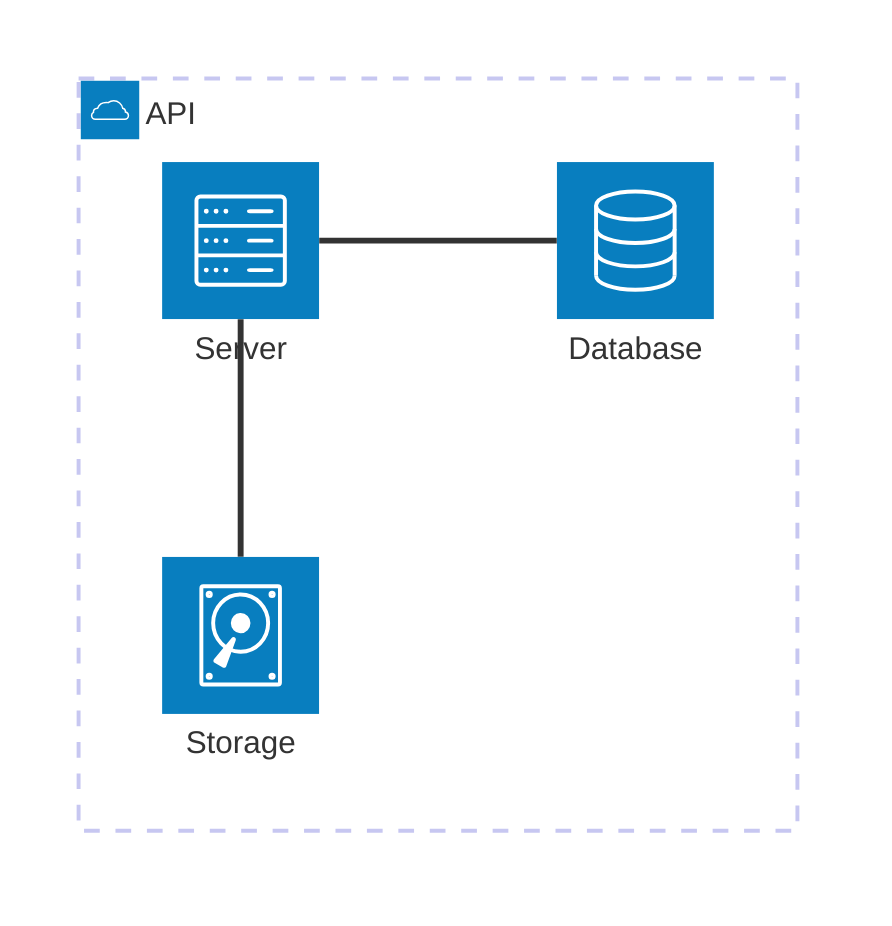

# Architecture

- Declaration: `architecture-beta`
- Maturity: `beta`
- External registration: `false`
- Tagged authority: `packages/mermaid/src/docs/syntax/architecture.md` at
  `mermaid@11.16.0`

## Use

Services, groups, icons, and directional connections.

## Configuration and limits

Use frontmatter for per-diagram configuration. Keep site configuration at
`securityLevel: strict`, reject unknown schema keys, keep remote icon/resource
loading disabled, and respect the runtime text/edge/time bounds.

This family is beta in the pinned release; disclose maturity and expect syntax
evolution.

## Minimal accessible example

