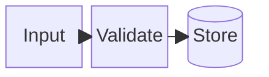

# Block

- Declaration: `block`
- Maturity: `stable`
- External registration: `false`
- Catalog accessibility mode: `adapter-comments`
- Tagged authority: `packages/mermaid/src/docs/syntax/block.md` at
  `mermaid@11.16.0`

## Use

Explicit block placement and architecture-like composition.

## Configuration and limits

Use frontmatter for per-diagram configuration. Keep site configuration at
`securityLevel: strict`, reject unknown schema keys, keep remote icon/resource
loading disabled, and respect the runtime text/edge/time bounds.

Use the pinned 11.16.0 behavior; verify the target host version before source
delivery.

Mermaid 11.16.0 tokenizes `accTitle` and `accDescr` for this family but its
block grammar does not accept them. The `ptlam-acc-*` lines below are a
versioned adapter contract: the pinned renderer removes them from its temporary
Mermaid input, then turns their text into SVG title, description, and ARIA
relationships. Raw Mermaid 11.16.0 block rendering does not support these lines.
Prefer a rendered static output unless the consumer uses the same adapter
contract.

## Minimal accessible example

