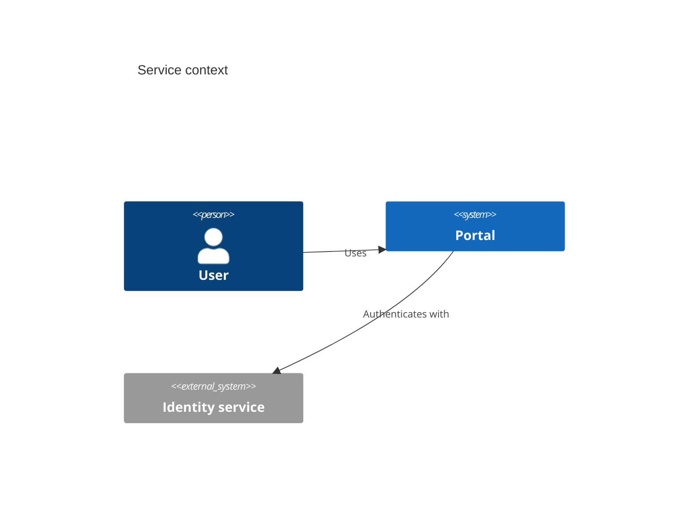

# C4

- Declaration: `C4Context`, `C4Container`, `C4Component`, `C4Dynamic`,
  `C4Deployment`
- Maturity: `experimental`
- External registration: `false`
- Catalog accessibility mode: `native-postprocess`
- Tagged authority: `packages/mermaid/src/docs/syntax/c4.md` at
  `mermaid@11.16.0`

## Use

Software context, container, component, dynamic, and deployment views.

## Configuration and limits

Use frontmatter for per-diagram configuration. Keep site configuration at
`securityLevel: strict`, reject unknown schema keys, keep remote icon/resource
loading disabled, and respect the runtime text/edge/time bounds.

This family is experimental in the pinned release; disclose maturity and expect
syntax evolution.

Mermaid 11.16.0 accepts the native accessibility directives below. Its rendered
SVG preserves the exact description and a matching `aria-describedby` link but
omits the title and `aria-labelledby`. The pinned renderer verifies and retains
that description, normalizes the SVG role, and adds the missing title
relationship. Prefer that static output over source delivery unless the target
host has equivalent behavior.

## Minimal accessible example

