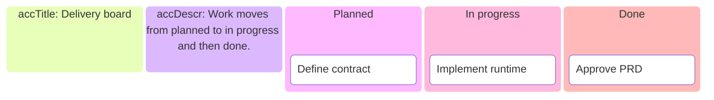

# Kanban

- Declaration: `kanban`
- Maturity: `stable`
- External registration: `false`
- Catalog accessibility mode: `native-postprocess`
- Tagged authority: `packages/mermaid/src/docs/syntax/kanban.md` at
  `mermaid@11.16.0`

## Use

Work items grouped by workflow columns.

## Configuration and limits

Use frontmatter for per-diagram configuration. Keep site configuration at
`securityLevel: strict`, reject unknown schema keys, keep remote icon/resource
loading disabled, and respect the runtime text/edge/time bounds.

Use the pinned 11.16.0 behavior; verify the target host version before source
delivery.

Mermaid 11.16.0 accepts the native accessibility directives below but omits
their title, description, and ARIA relationships from the rendered SVG. The
pinned renderer post-processes SVG to restore them. Prefer that static output
over source delivery unless the target host has equivalent behavior.

## Minimal accessible example

