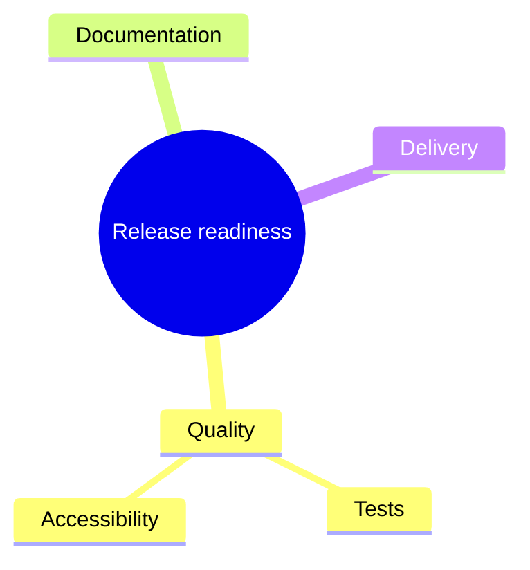

# Mindmap

- Declaration: `mindmap`
- Maturity: `stable`
- External registration: `false`
- Catalog accessibility mode: `adapter-comments`
- Tagged authority: `packages/mermaid/src/docs/syntax/mindmap.md` at
  `mermaid@11.16.0`

## Use

Hierarchical ideas around a central topic.

## Configuration and limits

Use frontmatter for per-diagram configuration. Keep site configuration at
`securityLevel: strict`, reject unknown schema keys, keep remote icon/resource
loading disabled, and respect the runtime text/edge/time bounds.

Use the pinned 11.16.0 behavior; verify the target host version before source
delivery.

Mermaid 11.16.0 does not accept native accessibility directives in this family's
body. The `ptlam-acc-*` comments below are a versioned adapter contract: the
pinned renderer turns them into SVG title, description, and ARIA relationships.
Other Mermaid hosts treat them as inert comments. Prefer a rendered static
output unless the consumer uses the same adapter contract.

## Minimal accessible example

