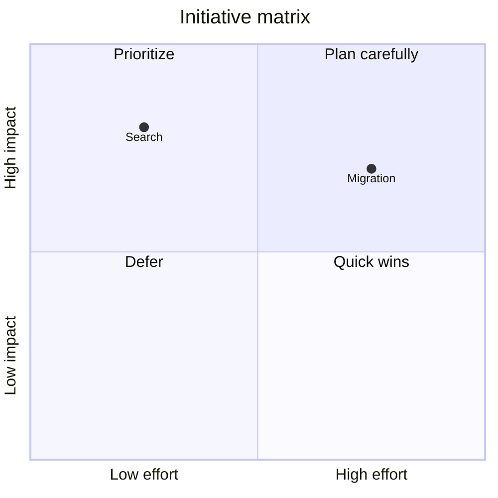

# Quadrant chart

- Declaration: `quadrantChart`
- Maturity: `stable`
- External registration: `false`
- Tagged authority: `packages/mermaid/src/docs/syntax/quadrantChart.md` at
  `mermaid@11.16.0`

## Use

Items positioned against two quantitative dimensions.

## Configuration and limits

Use frontmatter for per-diagram configuration. Keep site configuration at
`securityLevel: strict`, reject unknown schema keys, keep remote icon/resource
loading disabled, and respect the runtime text/edge/time bounds.

Use the pinned 11.16.0 behavior; verify the target host version before source
delivery.

## Minimal accessible example

