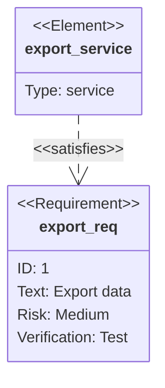

# Requirement

- Declaration: `requirementDiagram`
- Maturity: `stable`
- External registration: `false`
- Tagged authority: `packages/mermaid/src/docs/syntax/requirementDiagram.md` at
  `mermaid@11.16.0`

## Use

Requirements, elements, risks, and verification relationships.

## Configuration and limits

Use frontmatter for per-diagram configuration. Keep site configuration at
`securityLevel: strict`, reject unknown schema keys, keep remote icon/resource
loading disabled, and respect the runtime text/edge/time bounds.

Use the pinned 11.16.0 behavior; verify the target host version before source
delivery.

Unquoted field values stop at reserved grammar tokens in 11.16.0. Use a numeric
identifier as below or quote a free-form identifier that contains punctuation.

## Minimal accessible example

