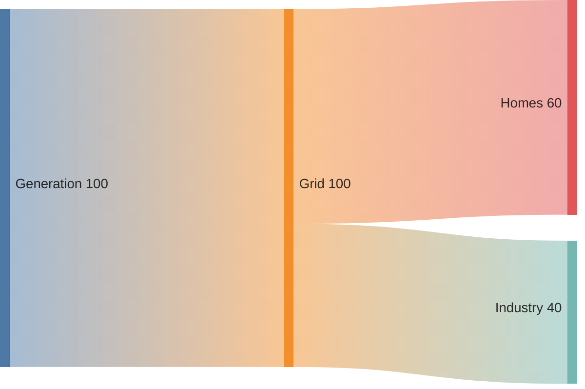

# Sankey

- Declaration: `sankey`
- Maturity: `stable`
- External registration: `false`
- Catalog accessibility mode: `adapter-comments`
- Tagged authority: `packages/mermaid/src/docs/syntax/sankey.md` at
  `mermaid@11.16.0`

## Use

Quantified flows between stages or categories.

## Configuration and limits

Use frontmatter for per-diagram configuration. Keep site configuration at
`securityLevel: strict`, reject unknown schema keys, keep remote icon/resource
loading disabled, and respect the runtime text/edge/time bounds.

Use the pinned 11.16.0 behavior; verify the target host version before source
delivery.

Mermaid 11.16.0 parses this family as comma-separated rows and does not accept
native accessibility directives in the body. The `ptlam-acc-*` comments below
are a versioned adapter contract: the pinned renderer turns them into SVG title,
description, and ARIA relationships. Other Mermaid hosts treat them as inert
comments. Prefer a rendered static output unless the consumer uses the same
adapter contract.

## Minimal accessible example

