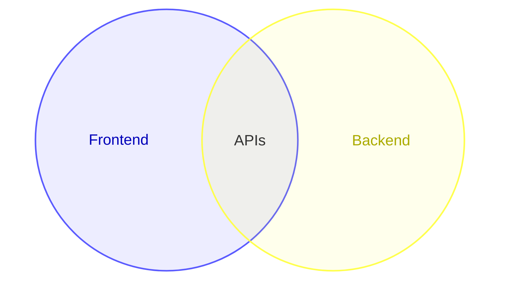

# Venn

- Declaration: `venn-beta`
- Maturity: `beta`
- External registration: `false`
- Catalog accessibility mode: `adapter-comments`
- Tagged authority: `packages/mermaid/src/docs/syntax/venn.md` at
  `mermaid@11.16.0`

## Use

Set membership and overlaps.

## Configuration and limits

Use frontmatter for per-diagram configuration. Keep site configuration at
`securityLevel: strict`, reject unknown schema keys, keep remote icon/resource
loading disabled, and respect the runtime text/edge/time bounds.

This family is beta in the pinned release; disclose maturity and expect syntax
evolution.

Mermaid 11.16.0 does not accept native accessibility directives in this beta
grammar. The `ptlam-acc-*` comments below are a versioned adapter contract: the
pinned renderer turns them into SVG title, description, and ARIA relationships.
Other Mermaid hosts treat them as inert comments. Prefer a rendered static
output unless the consumer uses the same adapter contract.

## Minimal accessible example

