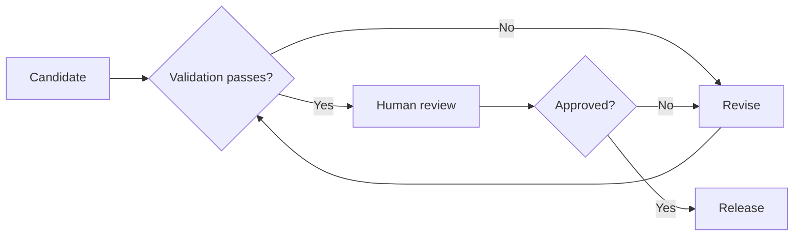

```mermaid
---
config:
  deterministicIds: true
  deterministicIDSeed: ptlam-mermaid-cases-release-flow
---
flowchart LR
  accTitle: Release readiness flow
  accDescr: A candidate passes validation and review before release, while failures return to revision.
  candidate[Candidate] --> validate{Validation passes?}
  validate -->|No| revise[Revise]
  revise --> validate
  validate -->|Yes| review[Human review]
  review --> approve{Approved?}
  approve -->|No| revise
  approve -->|Yes| release[Release]
```
