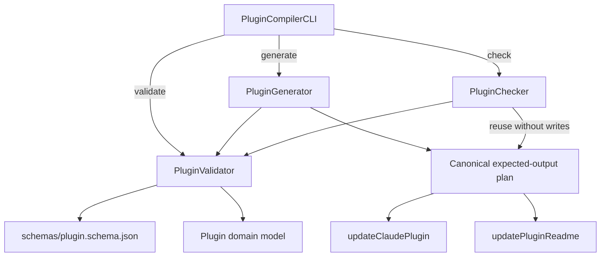
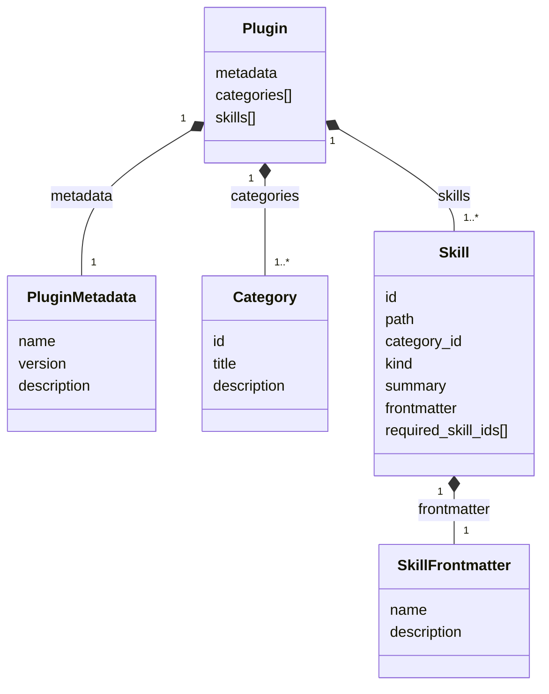

# Plugin Compiler

The Plugin Compiler turns the authored [`plugin.yml`](../../plugin.yml) and the
frontmatter of every catalogued `SKILL.md` into deterministic consumer files. It
validates the catalog, updates the Claude plugin and marketplace manifests, and
maintains the generated catalog sections in the repository README files.

The tool has one CLI gateway and one command component per public operation:

- `PluginValidator` validates sources and builds the domain model.
- `PluginGenerator` creates the canonical output plan and writes it safely.
- `PluginChecker` compares that same plan with the repository without writing.
- `PluginCompilerCLI` selects a command component and presents its result.

## Non-goals

The compiler does not install skills, resolve external versions, publish a
release, or maintain installation state. It compiles repository-owned metadata
only. Existing agent and plugin ecosystems remain responsible for installation
and updates.

## Commands

Run commands from the repository root:

```bash
npm run catalog:validate
npm run catalog:generate
npm run catalog:check
```

`validate` and `check` are read-only. `generate` is the only command allowed to
replace managed files.

## Layout

```text
tools/plugin-compiler/
├── README.md
├── plugin_compiler_cli.mjs
├── plugin_validator.mjs
├── plugin_generator.mjs
├── plugin_checker.mjs
├── models/
│   ├── plugin.mjs
│   ├── plugin_metadata.mjs
│   ├── category.mjs
│   ├── skill.mjs
│   └── skill_frontmatter.mjs
├── output_updaters/
│   ├── update_claude_plugin.mjs
│   └── update_plugin_readme.mjs
└── schemas/
    └── plugin.schema.json
```

Only the four command-layer files live at the tool root. Models, the source
schema, and pure output helpers are grouped by responsibility.

## Architecture



The dependency direction prevents duplicated rules:

- Generator and Checker reuse Validator instead of parsing sources again.
- Checker reuses Generator's expected-output plan instead of formatting files
  independently.
- Output updaters compute content but never read or write the filesystem.
- CLI handles terminal concerns but does not know catalog rules.

## Core components

| Component           | Public operation                                       | Owns                                                                                   | Does not own                                  |
| ------------------- | ------------------------------------------------------ | -------------------------------------------------------------------------------------- | --------------------------------------------- |
| `PluginCompilerCLI` | CLI command dispatch                                   | Arguments, dependency wiring, messages, exit codes                                     | Validation, output content, filesystem writes |
| `PluginValidator`   | `validatePlugin(request)`                              | Loading, strict parsing, schema checks, discovery, models, semantic and graph checks   | Generated output or terminal presentation     |
| `PluginGenerator`   | `generatePlugin(request)`, `buildExpectedOutputPlan()` | Validator delegation, canonical output plan, path safety, atomic complete-file writes  | Duplicate validation or drift verdicts        |
| `PluginChecker`     | `checkPlugin(request)`                                 | Validator delegation, reuse of the canonical plan, byte comparison, complete drift set | File mutation or independent formatting       |

`buildExpectedOutputPlan()` is a narrow collaboration seam between Generator and
Checker. It is not a fourth CLI command.

## Ubiquitous language

- **Manifest**: the authored `plugin.yml` document before validation.
- **Plugin**: the validated aggregate used by every downstream operation.
- **Plugin metadata**: versioned plugin identity owned by the Plugin aggregate;
  authored marketplace values are a separate immutable object on that aggregate.
- **Category**: an ordered skill grouping identified by a stable ID.
- **Skill**: one catalog member joined with its `SKILL.md` frontmatter.
- **Required skill ID**: a hard, same-release prerequisite stored directly on a
  Skill. Required-skill edges must reference existing skills and remain acyclic.
- **Expected-output plan**: a deterministic map of repository-relative paths to
  complete expected contents.
- **Drift**: a missing managed file or content that differs byte-for-byte from
  the expected plan.
- **Managed region**: a generated README section bounded by unique markers.

The tool deliberately has no DTO layer. Parsed values become domain models after
structural and semantic validation. Method boundaries use Request–Result object
values instead of transport classes.

## Domain models



Each model has its own explicit file and owns its immutable construction shape.
Validator enforces authored-value and cross-model invariants before
construction. Model values remain immutable for the lifetime of one command.
`required_skill_ids` belongs directly to `Skill`; there is no separate relation
model and no discovery-only `related` relation in version 1.

## Request–Result contracts

Requests are plain object values. `rootDir` is optional and defaults to the
repository root when invoked through the CLI.

| Operation        | Request                    | Result                                                   | Writes |
| ---------------- | -------------------------- | -------------------------------------------------------- | ------ |
| `validatePlugin` | `{ rootDir }`              | `{ plugin, diagnostics }`                                | No     |
| `generatePlugin` | `{ rootDir }`              | `{ plugin, changedPaths, unchangedPaths }`               | Yes    |
| `checkPlugin`    | `{ rootDir }`              | `{ plugin, isCurrent, drift }`                           | No     |
| Output plan      | `{ rootDir, plugin, ... }` | `{ entries, missing }`, for Generator–Checker reuse only | No     |

Validation and planning failures are reported as aggregate, actionable errors
before any write begins. Generated models are never returned partially.

## Source pipeline

`PluginValidator` runs the source pipeline in a fail-closed order:

1. Read `plugin.yml` from a real repository directory.
2. Parse strict YAML and reject duplicate keys, aliases, anchors, explicit tags,
   merge keys, unsupported node kinds, and unquoted plugin versions.
3. Validate the parsed shape with `schemas/plugin.schema.json`.
4. Validate category and skill IDs, membership, and required-skill references.
5. Discover every `skills/<category>/<skill>/SKILL.md` and reject missing,
   unlisted, duplicate, escaping, or symlinked paths.
6. Parse strict YAML frontmatter and join its name and description with the
   manifest entry.
7. Reject self-dependencies and dependency cycles.
8. Construct the immutable Plugin aggregate in authored order.

Schema validation answers whether the YAML has the supported structure. Semantic
validation answers whether its references and repository contents are coherent.

## Operation flows

### Validate

```text
CLI → PluginValidator → sources → schema → semantic checks → Plugin → result
```

No output content is calculated and no managed file is read or written.

### Generate

```text
CLI → PluginGenerator → PluginValidator → Plugin
    → Claude updater + README updater → expected-output plan
    → safety checks → atomic replacements → result
```

All expected content and all target paths are validated before the first
replacement. A preparation failure leaves every managed output unchanged. Each
changed file is replaced atomically, but the four-file set is intentionally not
a transaction: after a rare later operating-system write failure, rerun generate
to converge the complete set.

### Check

```text
CLI → PluginChecker → PluginValidator → Plugin
    → PluginGenerator expected-output plan → byte comparison → drift result
```

Checker never calls Generator's write path. Missing README inputs become drift
evidence rather than being created.

## Output updaters

`output_updaters/update_claude_plugin.mjs` computes complete contents for:

- `.claude-plugin/plugin.json`
- `.claude-plugin/marketplace.json`

`output_updaters/update_plugin_readme.mjs` replaces only marker-bounded regions
in:

- `README.md`
- `skills/README.md`

Both modules are deterministic pure functions. They receive model/current-text
values and return expected content values. They do not inspect paths, select a
command, compare disk, or write files.

README updates require exactly one ordered marker pair, reject nested or
generated reserved markers, preserve every byte outside the managed region, and
escape Markdown table cells. Table width uses Unicode display width so generated
Markdown stays Prettier-stable.

## Filesystem safety

Generator and Checker resolve every managed path beneath the repository root and
reject:

- repository roots that are links or non-directories;
- paths that escape the repository;
- symlinks at any existing path segment;
- non-directory parents;
- non-regular existing targets.

Generator writes complete files through exclusive temporary siblings followed by
rename. Temporary files are cleaned after failure. Checker only reads and
compares. This provides per-file atomicity without a transaction journal or
multi-file rollback engine.

## Error behavior

Validation errors aggregate independent manifest, skill, and graph issues when
possible. `PluginValidationError.diagnostics` contains the immutable issue list;
the message names each source and location. CLI exit codes are:

- `0`: successful operation; check found no drift.
- `1`: invalid sources, unsafe output, generation failure, or detected drift.
- `2`: unknown or missing command.

## Tests

Tests mirror the tool beneath level-specific roots:

```text
tests/
├── unit/tools/plugin-compiler/
│   ├── models/
│   ├── output_updaters/
│   │   └── test_fixtures/
│   └── plugin_compiler_cli.test.mjs
└── integration/tools/plugin-compiler/
    ├── test_doubles/
    ├── test_fixtures/
    ├── plugin_validator.test.mjs
    ├── plugin_generator.test.mjs
    ├── plugin_checker.test.mjs
    ├── plugin_compiler_architecture.test.mjs
    └── plugin_compiler_repository_workflow.test.mjs
```

Unit tests cover in-process public behavior without filesystem access.
Integration tests use isolated temporary repositories for the real filesystem,
parser, schema, Validator, Generator, and Checker collaborations. Every test is
written as Given–When–Then, and reusable doubles live at their nearest common
test scope.

Together they cover:

- strict YAML and schema failures;
- repository discovery, symlink, and relation invariants;
- domain-model construction and immutability;
- pure Claude and README updater output;
- marker, whitespace, escaping, and Unicode-width edge cases;
- Generator atomicity and path containment;
- Checker drift reporting and proof of no writes;
- CLI routing, messages, and exit codes;
- committed-output drift through `npm run catalog:check`.

Run:

```bash
npm test
npm run catalog:check
npm run markdown:check
```

## Maintainer workflows

### Add or move a skill

1. Create or move `skills/<category>/<skill-id>/SKILL.md`.
2. Keep the frontmatter `name` equal to the skill ID and directory name.
3. Add or update the skill in `plugin.yml` and set `required_skill_ids`.
4. Run `npm run catalog:generate`.
5. Review all generated changes, then run the complete checks.

### Change the plugin version

1. Update `plugin.version` in `plugin.yml` as a quoted string.
2. Generate and review `.claude-plugin/plugin.json`.
3. Run validation, drift, tests, and Markdown checks before release.

### Evolve the manifest schema

Treat `schema_version` as a compatibility boundary. Update the schema,
Validator, models, fixtures, README contract, and migration behavior together.
Never accept an unknown schema version silently.

### Add another generated target

Start with a pure, explicitly named updater under `output_updaters/`. Add its
result to Generator's canonical plan so Checker automatically verifies the same
content. Introduce a generic provider abstraction only after two real providers
demonstrate a stable common contract.

### Extract another module

Keep behavior private to its command component unless it has an independent,
reusable contract. Avoid one-function pass-through modules that merely expose an
implementation step.
