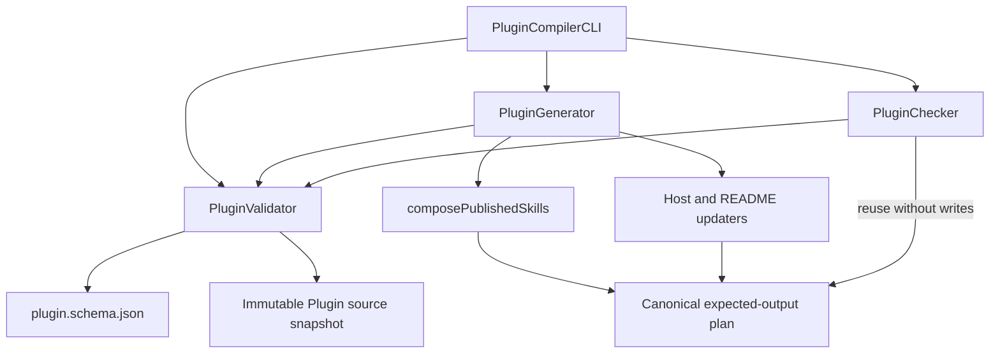
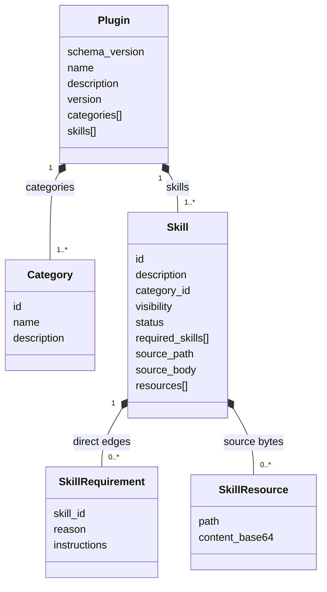

# Plugin Compiler

The Plugin Compiler turns authored v2 sources in [`plugin/`](../../plugin/) into
deterministic, self-contained public skills and consumer metadata. It validates
the complete source graph, composes required skills recursively, updates host
manifests and documentation, and detects drift without introducing a separate
package manager.

The tool has one CLI gateway and one command component per public operation:

- `PluginValidator` validates sources and builds an immutable source snapshot.
- `PluginGenerator` creates the canonical output plan and replaces managed
  outputs safely.
- `PluginChecker` compares that same plan with the repository without writing.
- `PluginCompilerCLI` selects a command component and presents its result.

## Non-goals

The compiler does not install skills, resolve external versions, publish a
release, or maintain installation state. Existing agent and plugin ecosystems
remain responsible for installation and updates. Every required skill belongs to
the same authored plugin release.

## Commands

Run commands from the repository root:

```bash
npm run catalog:validate
npm run catalog:generate
npm run catalog:check
```

`validate` and `check` are read-only. `generate` is the only command allowed to
replace compiler-owned outputs.

## Authored and generated layout

```text
plugin/
├── plugin.yml                         # authored manifest
└── skills/                            # all authored skills
    ├── internal-foundation/
    │   ├── SKILL.md                   # body only; no frontmatter
    │   └── references/
    └── public-skill/
        ├── SKILL.md
        ├── agents/
        ├── assets/
        ├── references/
        └── scripts/

skills/                                # generated and committed as one output
├── README.md
└── public-skill/
    ├── SKILL.md                       # generated frontmatter and dependency block
    └── references/
        └── required-skills/
            └── internal-foundation/   # recursively composed dependency
```

Both skill directories are flat: `category_id` is metadata, not a path segment.
`plugin/plugin.yml` and `plugin/skills/` are the only authored skill sources.
The complete root `skills/` tree is compiler-owned and must not be edited
manually.

## Source ownership

| Source                                  | Owns                                                                                         |
| --------------------------------------- | -------------------------------------------------------------------------------------------- |
| `plugin/plugin.yml`                     | Plugin identity, release version, marketplace data, categories, skill metadata, and graph    |
| `plugin/skills/<id>/SKILL.md`           | Runtime instruction body and required-skills insertion point                                 |
| Other files under `plugin/skills/<id>/` | Authored resources copied byte-for-byte while preserving relative paths                      |
| Generated `skills/<id>/`                | Self-contained public skill with generated frontmatter and recursively embedded dependencies |

The manifest's skill `id` becomes generated frontmatter `name`. Its
`description` becomes generated frontmatter `description` and is also used in
the README catalog. Source `SKILL.md` files cannot contain frontmatter.

Every source `SKILL.md` contains exactly one marker:

```markdown
<!-- PLUGIN-COMPILER:REQUIRED-SKILLS -->
```

The compiler removes an unused marker or replaces it with direct dependency
context. The reserved `references/required-skills/` namespace cannot exist in a
source skill because the compiler owns it in generated trees.

## Manifest v2

The manifest begins with commented, distinct schema and release versions:

```yaml
# Version of the plugin.yml structure understood by the compiler.
# Change only when the manifest schema becomes incompatible.
schema_version: 2

name: ptlam-skills
description: Portable skills authored and published by PTLam.

# Plugin release version. Build metadata after "+" does not affect SemVer
# precedence.
version: "0.1.0+1"
```

`version` must be quoted. The plugin has one release version; individual skills
and dependency edges do not have version constraints.

Categories are ordered manifest objects:

```yaml
categories:
  - id: engineering
    name: Engineering
    description: Skills for software engineering workflows.
```

Every authored skill has explicit distribution and lifecycle fields:

```yaml
skills:
  - id: ptlam-testing
    description: Universal automated testing workflow.
    category_id: engineering
    visibility: internal
    status: active
    required_skills: []

  - id: ptlam-testing-flutter
    description: Test Flutter and Dart projects.
    category_id: engineering
    visibility: public
    status: active
    required_skills:
      - skill_id: ptlam-testing
        reason: Provides universal testing rules.
        instructions:
          Read it first and apply its rules before Flutter-specific overrides.
```

`required_skills` order is the reading and display order, not an implicit
override policy. Each edge requires:

- `skill_id`: the source skill to embed;
- `reason`: why the dependency exists;
- `instructions`: how the agent applies it in the current skill.

`reason` and `instructions` are copied verbatim into the generated `SKILL.md`
next to a compiler-generated link to the embedded skill.

### Visibility and lifecycle

`visibility` and `status` are independent, required fields:

| Visibility | Status       | Generated as root skill | Allowed beneath an active output |
| ---------- | ------------ | ----------------------- | -------------------------------- |
| `internal` | `draft`      | No                      | No                               |
| `internal` | `active`     | No                      | Yes                              |
| `internal` | `deprecated` | No                      | Yes, with a validation warning   |
| `internal` | `archived`   | No                      | No                               |
| `public`   | `draft`      | No                      | No                               |
| `public`   | `active`     | Yes                     | Yes                              |
| `public`   | `deprecated` | Yes                     | Yes, with a validation warning   |
| `public`   | `archived`   | No                      | No                               |

A deprecated skill requires `deprecation.reason` and `deprecation.instructions`;
`deprecation.replacement_skill_id` is optional. An archived skill requires
`archive.reason` and may declare `archive.replacement_skill_id`. Replacement IDs
must identify another active skill. Deprecation notices appear in generated
public catalog documentation rather than runtime `SKILL.md` files; archive
metadata remains available to maintainers in the manifest.

## Compiler layout

```text
tools/plugin-compiler/
├── README.md
├── plugin-compiler-cli.mjs
├── plugin-validator.mjs
├── plugin-generator.mjs
├── plugin-checker.mjs
├── skill-composer.mjs
├── models/
│   ├── category.mjs
│   ├── plugin.mjs
│   ├── plugin-metadata.mjs
│   ├── skill.mjs
│   ├── skill-frontmatter.mjs
│   ├── skill-requirement.mjs
│   └── skill-resource.mjs
├── helpers/
│   ├── update-claude-plugin.mjs
│   ├── update-plugin-readme.mjs
│   └── validate-markdown-links.mjs
└── schemas/
    └── plugin.schema.json
```

Every JavaScript module filename uses kebab-case. Command-layer files and the
skill composer live at the tool root. Models, schema, and shared helpers are
grouped by responsibility.

## Architecture



The dependency direction prevents duplicated rules:

- Generator and Checker reuse Validator instead of parsing sources again.
- Checker reuses Generator's expected-output plan instead of formatting files
  independently.
- Composer and output updaters compute content but never mutate the filesystem.
- CLI handles terminal concerns but does not know source or composition rules.

## Domain model



The validator constructs models only after structural, semantic, graph, and
filesystem validation succeeds. `source_body` and immutable resource snapshots
give composition a validated input without rediscovering source files. A
resource exposes a fresh byte buffer for each output read, preserving the
model's immutable snapshot.

## Validation pipeline

`PluginValidator` fails closed:

1. Read `plugin/plugin.yml` through real, non-symlinked path segments.
2. Parse strict YAML 1.2. Comments are allowed; duplicate keys, anchors,
   aliases, merge keys, explicit tags, interpolation, and unquoted versions are
   rejected.
3. Validate the closed shape with `schemas/plugin.schema.json`.
4. Validate unique IDs, category references, lifecycle metadata, replacement
   targets, dependency status rules, and the acyclic graph.
5. Require a one-to-one mapping between manifest entries and flat
   `plugin/skills/<id>/` directories.
6. Reject source frontmatter, missing or duplicate compiler markers, source use
   of `references/required-skills/`, unsupported service or non-regular files,
   path escapes, symlinks, and invalid inline or reference-style local Markdown
   links.
7. Snapshot the source body and every resource byte in deterministic path order.
8. Construct the immutable Plugin aggregate.

Independent errors are aggregated in `PluginValidationError.diagnostics` when
possible. Non-failing diagnostics report deprecated dependencies and active
internal skills unreachable from a generated public root.

## Composition

For every `public` skill whose status is `active` or `deprecated`, the composer:

1. Generates frontmatter from manifest `id` and `description`.
2. Replaces the marker with each direct edge's verbatim `reason`,
   `instructions`, and generated link, preserving manifest order.
3. Copies authored resources byte-for-byte with their relative structure.
4. Recursively materializes each required skill under
   `references/required-skills/<skill-id>/`.

Recursive nesting deliberately duplicates a shared leaf along separate diamond
branches. That trade-off keeps each embedded skill self-contained and preserves
all relative links without runtime dependency resolution.

## Operation flows

### Validate

```text
CLI → PluginValidator → manifest + source trees → schema + semantic checks
    → immutable Plugin snapshot → result
```

No generated output is read or written.

### Generate

```text
CLI → PluginGenerator → PluginValidator → Plugin
    → Composer + host/README updaters → expected-output plan
    → safety checks → atomic replacements → result
```

The generator owns these outputs:

- `.claude-plugin/plugin.json`;
- `.claude-plugin/marketplace.json`;
- the marker-bounded catalog region in `README.md`;
- the complete `skills/` directory, including `skills/README.md`.

Changed standalone files use exclusive temporary siblings and atomic rename. The
generated `skills/` tree is built in a temporary directory and swapped as one
recoverable unit. Before the swap, the generator compares its bytes with the
output plan and resolves every generated local link within its standalone root
skill. Removed or no-longer-published skills therefore disappear without stale
files. The complete multi-output set is not a transaction, so a rare later
operating-system failure is recovered by rerunning generation.

### Check

```text
CLI → PluginChecker → PluginValidator → Plugin
    → Generator expected-output plan → byte comparison → drift result
```

Checker never calls the write path. It reports missing, unexpected, and changed
files across the complete compiler-owned output surface.

## Request-result contracts

Requests are plain objects. `rootDir` defaults to the repository root through
the CLI.

| Operation        | Request                    | Result                                                  | Writes |
| ---------------- | -------------------------- | ------------------------------------------------------- | ------ |
| `validatePlugin` | `{ rootDir }`              | `{ plugin, diagnostics }`                               | No     |
| `generatePlugin` | `{ rootDir }`              | `{ plugin, diagnostics, changedPaths, unchangedPaths }` | Yes    |
| `checkPlugin`    | `{ rootDir }`              | `{ plugin, diagnostics, isCurrent, drift }`             | No     |
| Output plan      | `{ rootDir, plugin, ... }` | `{ entries, missing, expectedSkills }`                  | No     |

Validation and planning complete before the first write. Partially validated
models and partially planned output sets are never returned.

## Tests

Tests mirror production capability beneath level-specific roots:

```text
tests/tools/plugin-compiler/
├── unit-tests/
│   ├── skill-composer.test.mjs
│   ├── helpers/
│   │   ├── update-claude-plugin.test.mjs
│   │   ├── update-plugin-readme.test.mjs
│   │   └── validate-markdown-links.test.mjs
│   ├── models/
│   └── plugin-compiler-cli.test.mjs
└── integration-tests/
    ├── plugin-validator.test.mjs
    ├── plugin-generator.test.mjs
    ├── plugin-checker.test.mjs
    └── plugin-compiler-repository-workflow.test.mjs
```

Every test uses explanatory uppercase phase comments. A phase with one condition
uses `// GIVEN: One concise sentence.`; a phase with multiple conditions uses an
uppercase `// GIVEN:` heading followed by punctuated `// - ...` lines. The same
format applies to `WHEN` and `THEN`.

Run the complete verification set with:

```bash
npm test
npm run catalog:check
npm run markdown:check
```

## Maintainer workflows

### Add or move a skill

1. Create or move `plugin/skills/<skill-id>/`.
2. Write a body-only `SKILL.md` with exactly one required-skills marker.
3. Add or update the skill in `plugin/plugin.yml`, including `category_id`,
   `visibility`, `status`, and `required_skills`.
4. Run `npm run catalog:generate` and review the root `skills/` replacement and
   other generated diffs.
5. Run validation, drift, tests, and Markdown checks.

### Change the plugin version

1. Update the quoted top-level `version` in `plugin/plugin.yml`.
2. Leave `schema_version` unchanged unless the manifest contract becomes
   incompatible.
3. Generate and review all committed outputs before release.

### Evolve the manifest schema

Treat `schema_version` as a compatibility boundary. Update the schema,
Validator, models, fixtures, documentation, and migration behavior together.
Never accept an unknown schema version silently.

### Add another generated target

Start with a pure, explicitly named updater or composer. Add its result to
Generator's canonical plan so Checker verifies the same content. Introduce a
generic provider abstraction only after two real providers demonstrate a stable
common contract.
